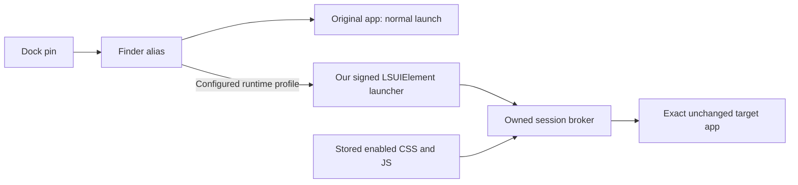

# Launching Electron apps from the Dock

Every discovered app, including ChatGPT, supports **Open App** and **Add to Dock**, even with no installed extensions. Generic shortcuts are real Finder aliases to the unchanged original app and open it normally. The current source configures mixed CSS/JS runtime profiles for the 47 catalog identities plus built-in Style Lab, experimental ChatGPT and assisted Claude. Full product proofs exist for Style Lab, VS Code and Figma’s login page; the [coverage table](CURRENT-COVERAGE.md) separates these from configured and historical results. Dock support and verified extension execution are separate capabilities.

Discovering an Electron framework, importing an extension, and passing a separate cosmetic compatibility trial do not automatically enable a launch profile. Executing extensions in each additional app needs an explicit runtime profile verified against its installed release: exact bundle identity, supported startup options, process and renderer identity, CSS lifecycle, and unchanged signing. See the [extension format](EXTENSION-FORMAT.md) for what the manager currently imports and runs.

## Launch path



A Finder alias opens its referenced item. It is not an executable launch configuration and has no documented facility for storing an argument vector. Generic aliases point directly to the original app. A runtime-profile alias references a small launcher app that supplies its fixed launch behavior. [Apple: creating and removing aliases](https://support.apple.com/guide/mac-help/create-and-remove-aliases-on-mac-mchlp1046/mac).

The generated launcher is our own signed app, with `LSUIElement` enabled and the target's display name and available bundled icon copied into it. Its normal running-app tile is hidden; this does not merge its pinned shortcut with the separate Electron process's Dock identity. A second icon for the running target may appear. [Apple: LSUIElement](https://developer.apple.com/library/archive/documentation/General/Reference/InfoPlistKeyReference/Articles/LaunchServicesKeys.html#//apple_ref/doc/uid/20001431-108256).

The wrapper reads its adjacent configuration and the saved library. For enabled Style Lab CSS/JS it starts the broker, which starts a new fixture process with the existing loopback debugger options and a fresh temporary profile. The broker verifies the fixed bundle, process identity, and exact fixture renderer, then applies the stored CSS and scripts. It watches the library for updates and writes session evidence outside both app bundles. The target's executable, resources, signing, and entitlements are left unchanged.

The experimental ChatGPT profile selects a separate fixed broker using ordinary Electron renderer debugging. It accepts at most 64 KiB combined CSS and 256 KiB combined JS. Its new JS controller and selection are source-tested but not live-verified in the installed app; it does not change protections or try debugging workarounds. It checks process and renderer identity and requires stylesheet readback before reporting an active session. The named Hide Sidebar Voice Button extension additionally requires a Voice-hidden check. Its earlier CSS-only [owned-renderer verification](../output/chatgpt-adapter/owned-renderer-result.json) covers hiding Voice, preserving composer/help, disabling, reload/reapplication, and removal; [69 native tests](../output/chatgpt-adapter/swift-tests.log) and [57 Node tests](../output/chatgpt-adapter/node-tests.log) passed.

The separate [live ChatGPT cold-start trial](../output/chatgpt-adapter/live-restart-result.json) passed on 26.901.51231, after the selector was rechecked against that updated app. The original process quit normally without forced termination, and the helper launched the unchanged original app as PID 59270. One matching Voice control changed from `display: flex` to `none`; stylesheet readback, signature, and fingerprint checks passed. The report identifies its session directory and real before/after footer screenshots. In that same process, [revision 2 disabled CSS](../output/chatgpt-adapter/live-disabled.json) and restored Voice to `display: flex`; [revision 3 re-enabled it](../output/chatgpt-adapter/live-reenabled.json) and returned Voice to `display: none`. Both recorded unchanged signatures. Full cleanup remains a separate check. Live reload is unverified: the optional check refused multiple packaged-app targets before issuing a reload.

Startup options belong to a new process. Clicking a shortcut cannot retroactively add them to an already running Electron app. For a profile requiring a fresh process, with enabled CSS/JS, the wrapper automatically presents a native macOS **Restart / Not Now** alert when the exact app is already running. Restart requests a normal quit, waits up to 30 seconds for the selected process to exit, then revalidates the configuration, library, and packaged runtime before reopening. Not Now leaves the app running and closes the launcher. An unreadable or changed process identity, declined quit, timeout, or cancellation prevents relaunch. These cold-start brokers independently reject an existing instance. Claude is an explicit exception: its assisted profile adopts the exact verified normal process and waits for user-enabled debugger setup, without restarting it just to connect. See [Claude setup](CLAUDE-SETUP.md). Apple similarly documents that launch arguments apply only when a new application instance is launched. [Apple: OpenConfiguration.arguments](https://developer.apple.com/documentation/appkit/nsworkspace/openconfiguration/arguments).

With no enabled extensions, the wrapper takes the normal app-opening path. Reopening an active wrapper activates its owned target instead of intentionally starting a second broker. The wrapper, broker, and target remain separate processes; the main Extensions Anywhere window need not stay open for an established session.

The wrapper routes Quit, SIGINT, and SIGTERM through one shutdown request, sending SIGTERM to its broker's positive PID and waiting for exit. The Style Lab broker disposes its scripts, removes CSS and verifies the baseline before stopping its owned fixture. Other brokers dispose their scripts/styles and detach owned connections without requesting target termination. A pipe-backed target can nevertheless exit when its helper closes the pipe, as Figma did in its passing trial. Ordinary disable kept Figma and its helper alive. `Process.terminate()` is deliberately not used here: Apple documents that it also signals subtasks, which interrupted stylesheet removal in the first fixture trial. [Apple: Process.terminate](https://developer.apple.com/documentation/foundation/process/terminate%28%29?language=objc).

## Runtime monitor and menu bar

**Settings → Prompt to restart apps without extensions** defaults to on and is saved locally. While Extensions Anywhere is running, a two-second poll and `NSWorkspace` app events check configured runtime profiles that have enabled extensions. Eligibility follows the currently configured profile and exact installed identity. Discovery or a historical CLI compatibility pass alone does not make an app eligible for restart prompts.

If a running eligible app has no matching healthy or starting extension session for **45 uninterrupted seconds**, the monitor automatically presents a native macOS **Restart / Not Now** alert with the app icon. Both the monitor and shortcut use the same AppKit alert factory; there is no custom restart panel. A healthy session or valid startup grace interrupts that countdown. Restart requires the user's approval and uses the normal app-quit path before reopening the configured shortcut. It never restarts an app merely because monitoring is enabled. **Not Now** suppresses further prompts for that process; a later app launch has its own identity and can be checked again. Turning the setting off disables these prompts while retaining saved extension preferences and Dock access.

Runtime status is read from bounded files in one canonical `Sessions/<UUID>` directory. The app key, target bundle, PID and process start time must match the expected app and current macOS launch. A read-only kernel identity check supplies the start time because AppKit's `launchDate` can be absent for a spawned app; an unreadable identity does not establish a match. A live broker is required. New brokers identify their format with `heartbeatVersion: 1`, keep the session's `startedAt`, and update `phaseStartedAt` only on a phase change. Status-only heartbeats normally run every two seconds through the same serialized loop as other status writes; they do not rewrite the full report or reset phase age. `updatedAt` and `heartbeatAt` use the same timestamp.

Normal heartbeat freshness is **15 seconds**. A `starting` or `applying` phase can allow up to **60 seconds** for a long operation, measured from its phase start; an old PID or a mismatched launch date does not receive that grace. The legacy broker from an already-running session may lack heartbeat fields. It is accepted only while its exact recorded target PID/start matches the current macOS app launch and its broker is alive. Old status files, unknown heartbeat versions, invalid paths and unreadable files do not establish a healthy session. These status rules support restart decisions; they do not replace CSS or integrity verification.

The menu lists **all tweaked apps**, including those without an integrated runtime. With up to five, it lists them directly. Above five, **Most Used** contains the five highest-ranked apps and **All Tweaked Apps** contains the full alphabetical list. Ranking uses actual observed activation counts, then most recent use, then app name. Counts and recency persist locally in the app's preferences and are keyed to the installed app path; requesting a launch does not count as an activation. Opening an unsupported app still uses its ordinary direct alias.

Live verification observed [Settings on/off/on](../output/restart-menu/settings-toggle.txt), with actual [Settings](../output/restart-menu/settings.png) and [menu](../output/restart-menu/menu.png) screenshots. The existing [legacy ChatGPT session was healthy](../output/restart-menu/live-current-session.json), using its kernel start identity for PID 59270. A normal Style Lab launch was followed by a [managed session at PID 87891](../output/restart-menu/live-relaunch.json), with green CSS (`rgb(22, 163, 74)`), white text, heartbeat version 1 and unchanged signing. Choosing Style Lab from the menu then activated that same process.

[All 106 Swift tests](../output/restart-menu/swift-tests.log) and [57 Node tests](../output/restart-menu/node-tests.log) passed. The [menu remained available after closing the main window and reopened it](../output/restart-menu/menu-background.txt). Style Lab then [quit normally](../output/restart-menu/style-lab-cleanup.json), with its temporary profile removed, controller disconnected and no forced termination.

Prompt timing, dismissal, restart failures, the larger menu layout and persisted ranking are covered by unit tests. The earlier live process transition established the resulting managed launch without capturing its prompt interaction. The [13 September native-alert check](NATIVE-RESTART-ALERTS.md) verified both the monitor and shortcut restart flows with Style Lab, plus cancellation in ChatGPT. An actual app-update installation was not tested.

## Files and ownership

All paths below are under `~/Library/Application Support/Extensions Anywhere/`. Generic app folders contain only `<App name>.app`, a Finder alias directly to the original installed app. The wrapper, configuration, and session layout below applies to the two runtime profiles:

```text
library.json
Launchers/
  <SHA256 of canonical target bundle path>/
    <App name> Launcher.app/     our generated, signed executable wrapper
    <App name>.app              Finder alias file pointing to that wrapper
    configuration.json          fixed profile, target, library, broker, sessions
    latest-session.json         pointer to the latest session directory
    Sessions/
      <UUID>/
        launcher.log
        status.json
        report.json
        extension-logs.json     bounded, attributed runtime events
        evidence/
          <timestamp>-<revision>/
            before.png
            styled.png
            restored.png
DockReceipts/
  <SHA256 of canonical target bundle path>.plist
DockVisibility/
  receipt.json                 temporary auto-hide change, while owned
```

The `.app` name of the alias in the launcher directory denotes an alias file, not another copy of the target bundle. The Dock receipt retains that physical alias URL. Alias resolution is used to read the wrapper's metadata without prompting or mounting volumes. Normal runtime sessions do not capture screenshots. Explicit diagnostic trials may contain the evidence subdirectory above, with images only for phases actually reached; a missing restored image is not a successful restoration.

Each runtime profile's application-support configuration is outside the wrapper's signature and selects an exact target path, bundle identifier, and broker. New builds package four fixed brokers, local modules, `ws`, the official Node executable, native identity reader and reviewed catalog inside each generated launcher's `Contents/Resources/Runtime`. The broker path must match its fixed entry point there, and Node's working directory is that same Runtime directory. The native launch utility and its adjacent catalog live under `Runtime/native`. The helper's source digest includes these resources; an existing helper updates only after it stops normally. Generic aliases do not need this configuration, Node, or runtime resources.

This packaging corrects a [recorded startup failure in our Slack helper](../output/e2e-50/2026-09-08/slack-startup-diagnosis/diagnosis.json): [Node's sampled stack](../output/e2e-50/2026-09-08/slack-startup-diagnosis/broker-sample.txt) was blocked resolving its Documents working directory before broker startup, alongside an observed Documents permission request attributed to our helper. The original TCC lines were not retained; the diagnosis distinguishes that observation from the saved raw sample and later empty log replay. No privacy permissions or target bundles were changed. Later [relocated packaged-runtime verification](release-review/2026-09-13/packaged-runtime-proof.md) and native mixed product proofs cover their exact recorded builds. The old Slack diagnosis is not relabeled as a new live Slack pass.

The manager and generated helpers bundle the pinned official Node runtime and native process-identity reader. End users do not need Homebrew or the source checkout. Node/npm and the selected Swift/macOS SDK are build requirements. The current distribution uses Developer ID rather than claiming an App Store sandbox design. [Apple: OpenConfiguration.arguments](https://developer.apple.com/documentation/appkit/nsworkspace/openconfiguration/arguments).

Generated launchers carry the source helper's build digest in their signed Info.plist. Preparing an inactive, outdated launcher updates and re-signs only that generated app. A running launcher must stop before an update. Comparing the helper's raw bytes with the build output is insufficient because signing changes its executable signature bytes; the digest avoids incorrectly demanding an update on every toggle.

## Enabling, disabling, and Dock recovery

The native manager stages a library change, validates the supported profile, prepares its launcher when needed, and saves the new extension preference. It then reconciles the selected app's Dock shortcut:

- At least one enabled extension: replace exactly one existing pin for the selected target, or append one managed launcher-alias pin if the target is not already pinned. Repeated requests recognize the owned pin instead of adding duplicates.
- Last enabled extension disabled or removed: restore a replaced pin to its complete original tile, or remove only the managed addition when there was no original pin.
- App without a configured runtime profile: prepare and install its ordinary direct Finder alias through the same scoped Dock receipts; retain its extension records without executing their source.

The selected-app top toolbar's **More** menu offers **Add to Dock** as its single Dock action, including with zero extensions. It attempts programmatic installation regardless of enabled records and opens the drag fallback if installation fails. Automatic installation failures while enabling extensions also open the fallback. The library's desired enabled state remains saved.

ChatGPT's previous direct alias can migrate to its generated helper at the same alias path only when the existing destination is the recognized original app; an unrecognized alias is rejected. An existing managed pin also needs a scoped restore/reinstall so its bundle-identifier metadata and receipt describe the helper. That [one-time migration passed](../output/chatgpt-adapter/installed-launcher.json) through native preparation and restore/install: GUID 3097887577, index 0, and unrelated pins were preserved. The [post-restart Dock check](../output/chatgpt-adapter/dock-receipt-check.json) confirmed helper metadata matched the installed receipt. This is distinct from the earlier direct-alias trial below; neither claims a literal Dock click or actual drag.

The pin component edits only `persistent-apps` in the current user's `com.apple.dock` preference domain. It preserves unrelated and unrecognized tiles, including tiles without GUIDs. A matching original must have a usable, unambiguous GUID. Replacement retains that GUID and position, updates the URL/label/bundle identifier, and clears stale bookmark/date/icon cache fields so Dock can resolve the launcher. An addition receives a fresh GUID checked against current pins and is appended once.

Before writing preferences, the component atomically saves a binary-plist receipt containing the owned GUID, target and replacement URLs, and expected managed tile. New version 2 receipts include the complete original tile, index, and original GUID only when a real pin was replaced. Additions have no invented original. Version 1 replacement receipts remain readable. The component refreshes and compares the current array before writing, verifies the full array after writing, and then advances the receipt state. Dock restarts only after a reported successful change.

Restore finds the owned tile at its **current** position. It requires the recorded GUID, URL, and unchanged stable tile fields; Dock-generated cache differences are tolerated. A replacement restores the original there; an addition removes only that tile. Other current pins and edits remain. If the user repoints, renames, removes, or duplicates the owned pin, the operation reports a conflict. Separately pinning the original also prevents restoring a replacement over it; removing an owned addition preserves a separately added original. No operation restores a whole-Dock backup.

Prepared/restoring receipts remain available after failures. A failed prepared addition can retry only while its target URL, alias URL, and GUID remain absent. A saved `restoring` intent can recognize that the original was already restored, or that the addition's GUID and alias URL are both gone, without rewriting other pins. An installed receipt whose pin was subsequently removed by the user is still a conflict. Receipt state alone is not proof of a successful write.

A Dock conflict does not undo the saved library preference. Disabling remains saved even when its pin cannot be restored or removed. Review the error and current pin, then use **Add to Dock** for a deliberate retry when appropriate. Preserve the receipt while recovery is unresolved. Preferences read/compare/write reduces accidental overwrites, but it is not an atomic transaction with the separate Dock process.

The `persistent-apps` tile schema is an undocumented consumer integration, not a guaranteed public pin-replacement API. Finder alias behavior, Dock normalization, and caches require testing on each supported macOS version. In particular, if Dock rewrites an alias URL to its resolved wrapper URL, record that behavior and verify ownership/restore before calling the integration successful.

## Compact drag fallback

The fallback is a compact, borderless 480 × 164-point floating panel, placed 12 points above the bottom Dock (or beside a side Dock). It reads fresh screen work-area bounds briefly after revealing Dock so placement follows the newly reserved space; movement or icon pickup stops repositioning. Its horizontal layout vertically centers the app icon and instructions. It has no traffic lights or **Done** button; a custom top-right **Close** (×) button, Escape, or Command-W dismisses it. Dragging exports the real Finder alias file URL.

At pickup, the controller records the positions of Dock entries matching the canonical alias path or resolved launcher path. After an accepted drag, it polls at roughly 200 ms intervals through a three-second deadline. It closes automatically only when a matching entry is newly present or its recorded position changes. An unchanged already-pinned entry cannot acknowledge a successful drop elsewhere; cancelled drops and unchanged same-position drops remain open. Verification also requires the same presentation and drag UUID. Starting another drag or closing the panel cancels its pending poll, so delayed callbacks cannot close a replacement panel.

This confirms an observed Dock change, not an operating-system report naming the drop destination. Unrelated concurrent Dock rearrangement could change matching indices, so live evidence should record the actual drop and surrounding pin state. If the controller cannot confirm a change before the deadline, the panel remains available to retry or close.

The drop check confirms pin presence; it does not adopt a manually created tile into a managed-pin receipt. Automatic last-disable removal/restoration applies to receipt-owned programmatic pins. A manually dropped pin remains user-managed unless an existing receipt still matches it exactly.

When the panel opens and Dock auto-hide is explicitly enabled, the visibility component saves a separate recovery receipt, temporarily turns auto-hide off, and refreshes Dock **before** pickup. If auto-hide was already off or unset, it leaves that preference alone. Picking up the icon starts a ten-second restoration deadline; another pickup resets it. Closing the panel always cancels the timer and restores auto-hide immediately, whether closed manually or after a confirmed drop. While the panel stays open, the ten-second pickup deadline still applies. Normal app quit restores the owned temporary setting; after an interrupted/crashed run, the next startup attempts receipt-based recovery.

Visibility restoration checks the saved receipt and current temporary preference rather than overwriting an observable external change. It removes its receipt when recovery completes. The pin receipt and visibility receipt have separate purposes. The ten-second restoration may refresh Dock during a long drag. Its timer passed the live preference check below; an actual accepted Dock drop still requires verification.

## Manual end-to-end verification

### Observed on macOS 27.0, 6 September 2026

The native **Add Extension** sheet imported Green buttons, and enabling it created the launcher/alias and replaced the test fixture pin. The Dock retained the physical alias URL after restart. The original three unrelated pins remained exactly equal, including their order and all tile fields. Disabling restored Style Lab's original tile and live computed appearance.

The **Open App** button then opened the exact alias URL stored in the Dock pin. The observed target arguments were `--remote-debugging-port=0`, `--remote-debugging-address=127.0.0.1`, and a fresh `--user-data-dir`. The button changed from `rgb(41, 63, 49)` to `rgb(22, 163, 74)` with white text. Its original click handler still worked. Enabled CSS survived reload, and disabled CSS stayed removed after reload.

After fixing the update-digest and shutdown issues described above, a fresh session completed enabled → disabled → enabled revisions. Signaling the wrapper removed CSS and verified its baseline before child termination, closed the connection/listener, removed the temporary profile, and left no owned wrapper, broker, or fixture process. No SIGKILL was used. The final strict signature, CDHash, and complete installed bundle fingerprint matched the pre-install source baseline. All 32 Swift and 49 Node tests passed, including the existing owned CSS/JS regression proof.

Evidence: [result and explicit limitations](../output/dock-proof/2026-09-06T15-46-19.421Z/result.json), [passing session report](../output/dock-proof/2026-09-06T15-46-19.421Z/passing-session/report.json), [before](../output/dock-proof/2026-09-06T15-46-19.421Z/passing-session/evidence/2026-09-06T16-03-23.364Z-1/before.png), [styled](../output/dock-proof/2026-09-06T15-46-19.421Z/passing-session/evidence/2026-09-06T16-03-23.364Z-1/styled.png), [restored](../output/dock-proof/2026-09-06T15-46-19.421Z/passing-session/evidence/2026-09-06T16-03-23.364Z-1/restored.png). The earlier failed shutdown report remains in the launcher Sessions directory; it is not counted as a clean pass.

At the end of that session, a literal Dock click, duplicate running-icon behavior, third-party native launch profiles, live multi-extension cascade, and live restoration after moving the pin remained unverified. The pure tests cover cascade ordering and moved-pin restoration. The computer-use Dock surface timed out; a manual click was requested but not confirmed. The later managed-addition trial below supersedes that session's final pin arrangement.

### Programmatic addition and removal, 6 September 2026

The live missing-pin trial added the launcher, removed only its owned addition, and added the launcher again for the final pinned state. Unrelated pins remained unchanged. [Recorded result](../output/dock-install/2026-09-06T16-33-30Z/result.json).

The compact implementation passed all **48 Swift tests** at **17:50:54 on 6 September 2026**, and its release build succeeded. [Swift test log](../output/dock-install/compact-panel/swift-tests.log), [release build log](../output/dock-install/compact-panel/build.log). **Not yet claimed:** a real Dock drop accepted by the compact fallback or automatic panel closure after that drop. The UI automation tool returned `noWindowsAvailable` when attempting a drag from this floating panel. A pin successfully added by code does not establish those drag-specific behaviors or a literal Dock-click launch.

### Procedure for a complete Dock claim

Perform this procedure only against the owned Style Lab fixture. Keep a new evidence directory for each run, and preserve any pre-existing extension records and Dock state.

1. Record macOS and app versions, the exact installed fixture path and bundle identifier, its strict signature/CDHash and full bundle fingerprint. Use the existing integrity helper; do not rebuild or re-sign the fixture during the trial. Confirm Style Lab is stopped using process identity, not a name-only match.
2. Record the original Style Lab pin's complete tile, GUID, position, and the other persistent tiles, or explicitly record that no target pin exists. Exercise both existing-pin replacement and missing-pin addition as separate cases; no manual prerequisite pin is needed for addition.
3. In Extensions Anywhere, select Style Lab and add the [Green buttons manifest](../examples/green-buttons/manifest.json). Enable it. Confirm the saved library record, generated signed wrapper, real Finder alias, and prepared/installed receipt. Check that one target pin was replaced or one managed alias was appended, and other tiles retained their order and contents. Repeat **Add to Dock** and verify that it adds no duplicate.
4. Click that **Dock pin**. Opening the wrapper from Finder, clicking **Open App**, or running the broker directly is useful component testing, but does not establish that the Dock path works. Save evidence identifying the pin and the activation used.
5. Use **Show Session Logs** to locate the new UUID session. Check the recorded process identity and exclusive owned instance, the exact fixture renderer, enabled extension IDs, CSS hash, and active phase. Visually inspect `before.png` and `styled.png`. For the example, the fixture button should have `rgb(22, 163, 74)` background and white text; its original click behavior should still work.
6. Disable the extension while the fixture remains alive. Wait for the broker's next library update and examine the restored screenshot and computed baseline. Confirm that a replaced original pin is restored or that a managed addition is removed. Re-enable and verify another styled revision. Test multiple CSS files/extensions in order; disabling one must retain the others and their combined effect.
7. Reload the fixture renderer with CSS enabled and verify the same styling returns once. Disable it and reload again to verify the original appearance remains. Record this as a separate check; the existing reload listener alone is not evidence that this run passed.
8. Move only the owned pin, then disable its last extension. Confirm that restoration or removal uses that current slot and preserves unrelated Dock edits. Exercise renamed/removed/repointed ownership conflicts in a separate controlled trial; expect an explicit conflict and no broad rollback.
9. For a full cleanup proof, request normal termination of the **verified owned launcher/broker** while the fixture is still alive, allowing it to remove CSS before stopping its child. Review the final report for computed restoration, transport closure, child exit, temporary-profile removal, final integrity, and errors. A fixture that exits first can end its runtime CSS, but cannot provide an after-exit screenshot or a new explicit restoration check. Record that limitation.
10. Disable/remove the last enabled extension and verify the original pin or original absence again. Launch the fixture normally and confirm its original appearance. Preserve receipts, session reports, screenshots, and a final full bundle/signature comparison. Do not delete the fixture or unrelated app data as cleanup.

### Separate fallback verification

Exercise this section when **More → Add to Dock** encounters a programmatic installation failure and opens the compact panel. A successful installation does not exercise the drag fallback. Record the original auto-hide value and relevant pins first. Verify the compact panel sits just above Dock, has vertically centered horizontal content, a custom top-right Close (×) button, no traffic lights or Done button, and a draggable alias. With auto-hide enabled, verify the Dock becomes visible on presentation. Close before pickup and confirm immediate restoration.

Reopen, pick up the icon, and record the pickup time and baseline matching-pin positions. Test cancellation, dropping elsewhere with an unchanged existing pin, and a real Dock drop separately. For the Dock case, confirm a newly added or moved alias/resolved-launcher entry before accepting the panel's automatic closure as a pass. An unchanged same-slot drop should remain open. Verify auto-hide restores immediately on closing, including after pickup, and that a cancelled old timer cannot affect a reopened panel. Separately verify the ten-second deadline while the panel remains open. Also check normal quit and next-startup receipt recovery in controlled runs. Retain screenshots/timestamps and exact before/after preference evidence; do not infer these results from mocked tests or the programmatic-add report.

## Evidence required for a passing claim

| Claim | Required evidence |
| --- | --- |
| Dock activation works | Actual Dock click, the selected pin's URL/GUID, alias resolution, generated wrapper signature, and the resulting wrapper/broker/fixture session identities. |
| Correct CSS selection | Persisted enabled extension IDs, ordered source records, combined CSS byte count and hash; no enabled JS or mixed package. |
| Visible styling | Reviewed original/styled/restored PNGs plus computed button properties; a report's `active` phase alone is insufficient. |
| Live updates and reload | Recorded revisions for enable/disable, restoration before the next application, and explicit reload checks. |
| Target unchanged | Strict valid signature, matching CDHash, and matching complete bundle fingerprint before application, while styled, and after cleanup. |
| Scoped Dock recovery | Version 2 owned-GUID receipt with a real optional original, or a valid legacy version 1 receipt; exact managed pin restored/removed at its current position; unrelated changes preserved. |
| Drag fallback | Actual accepted drag plus a newly added/moved canonical alias or resolved-launcher entry relative to pickup; unchanged already-pinned entries and cancelled/unconfirmed drags remain open; stale callbacks are rejected. |
| Temporary Dock visibility | Before/after auto-hide values, pickup timestamp, ten-second deadline while open, immediate restoration on close before or after pickup, and quit/startup recovery evidence. |
| Clean session end | Explicit removal when the renderer is alive, no unresolved cleanup errors, owned child exit without an unexplained forced stop, closed controller/listener, removed temporary profile, and no remaining owned helper processes. Independently verify gaps not covered by the report. |

A successful Style Lab run establishes this owned fixture path only. Executing extensions in third-party apps requires their own runtime profiles and evidence; ordinary Dock aliases do not require those profiles.

Implementation: [ElectronLauncher.swift](../macos/Sources/ElectronLauncher.swift), [LauncherMain.swift](../macos/Launcher/LauncherMain.swift), [DockShortcut.swift](../macos/Sources/DockShortcut.swift), [DockInstallWindow.swift](../macos/Sources/DockInstallWindow.swift), [DockVisibility.swift](../macos/Sources/DockVisibility.swift), [dock-fixture-session.mjs](../scripts/dock-fixture-session.mjs), [dock-chatgpt-session.mjs](../scripts/dock-chatgpt-session.mjs), [dock-library.mjs](../lib/dock-library.mjs), and [integrity.mjs](../lib/integrity.mjs).

Historical check, superseded for panel-close behavior: a manager-driven check passed against the real Dock with simulated pickup and a deadline retained after simulated panel closure. The current implementation instead restores immediately on closing. Auto-hide was still off at 9.826 seconds, restored by 10.576 seconds, and the recovery receipt was removed. The original auto-hide setting is restored. This exercised actual preferences and the run-loop timer, not a UI drag (`actualUIDrag: false`). [Live visibility result](../output/dock-install/compact-panel/live-visibility.json).

Earlier close check: all 52 native tests passed, including cancellation of a previous popup’s timer. The manager-driven live check restored the real Dock preference in approximately 69 ms immediately after simulated pickup/closure, cancelled the pending deadline, and removed its recovery receipt. This verifies actual preferences with simulated UI callbacks. [Close result](../output/dock-install/close-and-chatgpt/live-close.json), [test log](../output/dock-install/close-and-chatgpt/swift-tests.log).

## Generic Dock verification

Before the ChatGPT runtime profile was added, all 64 native tests passed. Real Finder alias creation/resolution passed for all 50 discovered apps outside the then-existing Style Lab runtime branch (51 discovered total). This historical coverage check did not launch those apps or change their Dock pins. [Tests](../output/dock-all-apps/swift-tests.log), [alias coverage](../output/dock-all-apps/installed-aliases.json), [build](../output/dock-all-apps/build.log).

In that ordinary-shortcut trial, ChatGPT's **More → Add to Dock** installed its direct alias while preserving GUID 3097887577, its original position, and both unrelated pins. **Open App** activated the original `/Applications/ChatGPT.app`. Disabling its last extension restored the complete original Dock state; re-enabling reinstalled the alias. Strict signature verification passed and the signature details were unchanged. The enabled preference and managed pin were left installed at that trial's end. Bruno's zero-extension page also exposed enabled Dock actions. [Live result](../output/dock-all-apps/chatgpt-live-result.json). No literal Dock click or actual drag was claimed. This is not evidence for the new ChatGPT CSS runtime; generic aliases still do not execute saved extensions.
